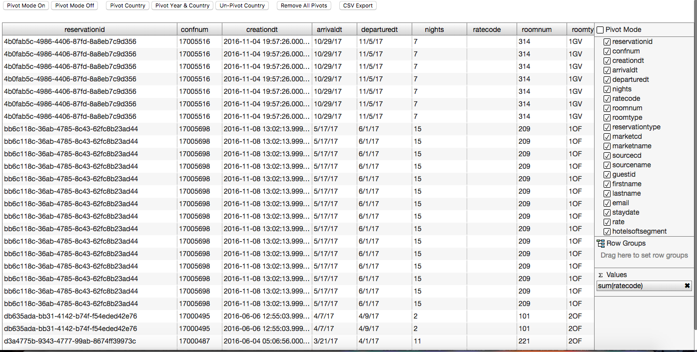

ag-Grid: NPM, Gulp and Browserify
==============
Agrid supports CommonJs or Require Js, So i used it.

Example of using ag-Grid with CommonJS

Building
==============

To build:
-  step1:`npm install or npm i`
- step2: `npm install gulp -g`
- step3: `gulp`

Once step 3 is complete goto `index.html`,`right click `and run it . 
All the data is from data.json , Header width is fixed in Main.js accoding data.Json . 

Here is how it should look 

